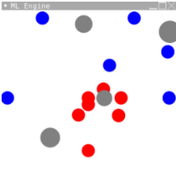

# Java Machine Learning Engine

### For a Primitive Asteroids Simulation

This was done for my 💻CS20A Final Project. Why? Idfk either.

#### Summary 📄

Ships are blue(`alive`) and red(`dead`) circles and asteroids are grey circles. The Engine attempts to learn to avoid asteroids using a genetic algorithm, and a custom coded network.

Note that the network modifies `edge weights` rather than `node weights`, since it was easier to program and I felt lazy that day. 😴

Okay enough emojis here's a picture:

 </img>

#### Known bugs 🪲

The program still has some bugs, since it was created in a rush (kind of), fix them if you want ig? I might fix them later. I might

| Bug                                        | Predicted Location           | Status                                                                                                          |
| ------------------------------------------ | ---------------------------- | --------------------------------------------------------------------------------------------------------------- |
| Packages are not setup correctly           | `All files`                  | Project was created on repl.it :skull:, so packages are setup wrong- not a hard fix though                      |
| Asteroids get stuck on edges/go off screen | `Asteroid.java, in update()` | Bug is likely caused by asteroids being out of bounds for 2 updates and switching back and forth over and over  |
| Genetic Algorithm assigns by reference     | `Learner.java, Line 37`      | Assigns networks to the worse half by reference, meaning only 15 agents show up, the others are just duplicates |

⚠️ Note: The overall project design is capable of producing _some_ results, but lacks optimization ☠️, so it won't produce a really good result.

👍 Improvements: Boundraries kill ships, rework ship AI to move more constantly, address overfitting.

#### Running it

If you just want to try it, you can view the replit <a href="https://replit.com/@GauthamVenkates/CS-20A-Final-Project">here</a>. If you want to play around with the project, I suggest forking this repo and moving the code into a working javaFX environment.

#### Stats, why not

🕐 Hours wasted using replit: `10-20`
yeah that's it